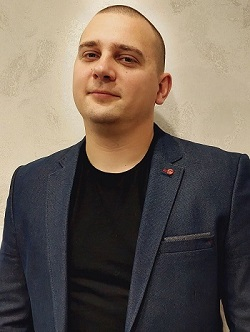

# Vadim Hmys
## FRONTEND DEVELOPER

### ABOUT MYSELF

Good knowledge of HTML, CSS, preprocessors (SASS), JAVASCRIPT. Understanding of the BEM methodology, good command of the FIGMA and Adobe Photoshop graphics editors, I can work with the GIT version control system, use the GULP build system.

I learn quickly, I am purposeful, hardworking and disciplined. I want to develop in the field of information technology, in particular in front-end development.

### EDUCATION

**Telecommunications engineer**

Work experience: 2012 - 2022

### SKILLS AND PROFICIENCY

* HTML5, CSS3
* SASS(SCSS)
* BEM
* JavaScript
* Git
* VS Code, Brackets
* Adobe Photoshop, Figma
* Gulp

### LANGUAGES

1. Belarusian (native)
2. Russian (native)
3. English (A2-B1)

### COURSES

* Website development with HTML, CSS & JavaScript (IT-Academy) [certificate](images/Certificate.jpg)
* RS Schools Course [certificate](images/Certificate_rsschool.jpg)
* Codewars [profile](https://www.codewars.com/users/vadimhmys)
* JavaScript Manual on [learn.javascript.ru](https://learn.javascript.ru/)