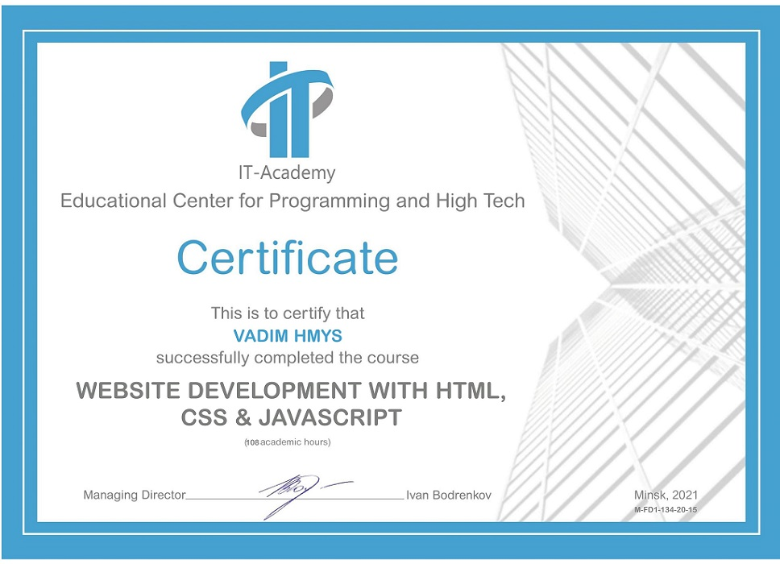

# Vadim Hmys
************
## Contact information


**Phone:** +375 29 1086014  

**Email:**  vadim-hmys@yandex.ru  

**Discord:** Vadim Hmys (@vadimhmys)  


************
## About yourself


My way in programming began with C++. I was writing small programs for microcontrollers. It was my hobby. But 
soon I gave up this activity, because radio components are expensive by us and it takes a long time to wait for
them from China.


I decided to try something else and started learning JavaScript to be able to create websites. I like the fact
that I can immediately see the result of my work.


Today I know HTML, CSS and basic JS quite well. I want to improve and expand my knowledge of JS, get practical
skills in programming, learn React. In the future, I'd like to become a frontend developer.


*********
## Skills and Proficiency

* HTML5, CSS3
* Basic JavaScript
* Git
* VS Code, Brackets
* Adobe Photoshop, Figma
* Gulp

*********
## Code example


**What day of the month was many days ago:** *create a function* ***getDateAgo(date, days)*** *that returns a number that*
 *was* ***days***  *days ago from date* ***date*** 


 ```
 function getDateAgo(date, days) {
     let dateCopy = new Date(date);
     dateCopy.setDate(date.getDate() - days);
     return dateCopy.getDate();
 }

 ```

 *********
## Work examples


 1. [Web-site for Mary Losewa](https://vadimhmys.github.io/MaryLosewa.github.io/) 
 2. [Restaurant](https://vadimhmys.github.io/restaurant/)


 ********
 ## Courses


 * Website development with HTML, CSS & JavaScript (IT-Academy)


 


 * JavaScript Manual on [learn.javascript.ru](https://learn.javascript.ru)
 * RS Schools Course


 ********